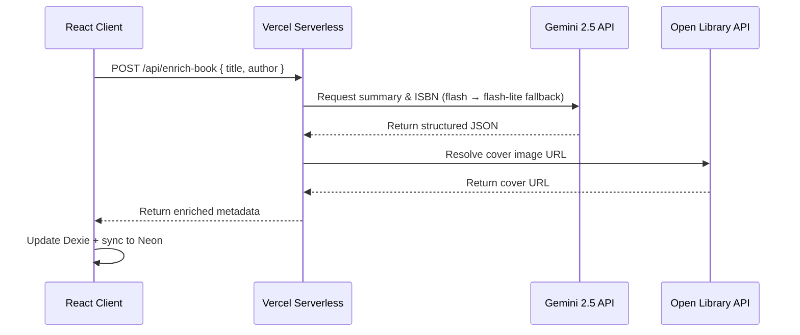
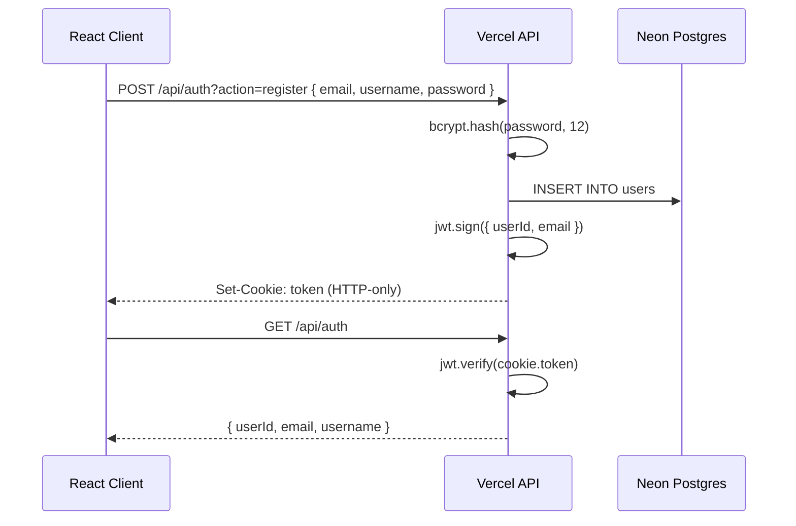
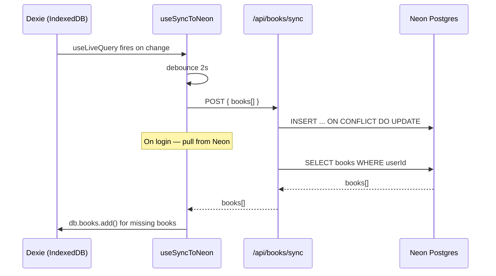

# 📚 ReadLog

A full-stack, mobile-first reading tracker built with **React 19**, **Vite 6**, and **Dexie.js**, enriched with **Google Gemini 2.5 AI** and backed by **Neon serverless Postgres** with a custom JWT auth system.

Live: [reading-log-app-ebon.vercel.app](https://reading-log-app-ebon.vercel.app)

---

## ⚡ Key Features

- **Mobile-first UI** — Bottom nav + FAB on mobile, responsive sidebar on desktop
- **Local-first architecture** — Instant read/write via IndexedDB (Dexie.js), synced to Neon in the background
- **Custom JWT auth** — Roll-your-own register/login/logout with bcrypt password hashing and HTTP-only cookies
- **Gemini AI enrichment** — Cover art, page counts, and spoiler-free summaries fetched automatically when you add a book
- **Genre-based exploration** — Pick one or more genres and Gemini returns 6 curated book recommendations
- **Friends system** — Send/accept friend requests, view friends' reading activity in real time, pending request UI
- **Book recommendations** — Recommend books to friends with a personal message; add them to your library in one tap
- **Bidirectional sync** — Dexie tombstone pattern syncs to Neon on every change; pulls from Neon on login
- **Book reviews & ratings** — Write a review and rate finished books with a 5-star system
- **Notes & quotes** — Add notes or quotes to any book with optional page numbers; view all notes in a dedicated screen
- **Reading streak** — Tracks consecutive days with reading sessions; displayed with a live count
- **Stats dashboard** — Total books, pages read, completion rate, library breakdown, 7-day activity chart, top authors, notes stats
- **Notifications** — Real-time badge count for friend requests, accepted requests, and book recommendations
- **Consolidated API** — 7 serverless functions (down from 13) using method + action routing to stay within Vercel's free tier

---

## 🏗️ Architecture & Data Flow

### AI Enrichment Flow


### Auth Flow


### Sync Flow


---

## 🛠️ Tech Stack

**Frontend**
- React 19 + TypeScript
- Vite 6
- Tailwind CSS v4
- Dexie.js + dexie-react-hooks (IndexedDB)
- Lucide React, Sonner (toasts)

**Backend**
- Vercel Serverless Functions (`@vercel/node`)
- Neon serverless Postgres
- Drizzle ORM
- bcryptjs + jsonwebtoken + cookie
- `@neondatabase/serverless`

**AI**
- Google Gemini 2.5 Flash (flash-lite fallback on 429/503)
- Open Library Covers API

---

## 📱 Screens

| Screen | Description |
|--------|-------------|
| Home | Greeting, now reading card, stats strip, library preview |
| Library | Full book list with search + status filters, cover art, summaries |
| Book Detail | Progress stepper, status switcher, rating, review, notes & quotes |
| Explore | Genre picker → Gemini returns 6 curated book recommendations |
| Stats | Books, pages, streak, breakdown bar, 7-day activity chart, top authors |
| Friends | Friend requests, activity feed, send book recs |
| Recommendations | Books recommended by friends, add to library |
| My Notes | All notes and quotes across your library, filterable by type |
| Notifications | Friend requests, accepted requests, new recs with badge count |
| Profile | User info + sign out |

---

## 🗄️ Database Schema

```sql
users                -- id, email, username, password_hash, created_at
books                -- id, user_id, title, author, status, pages_read, total_pages,
                     -- cover_url, summary, isbn, metadata_status, deleted, created_at, updated_at
friendships          -- id, requester_id, addressee_id, status (pending|accepted|declined), created_at
book_recommendations -- id, from_user_id, to_user_id, book_id, message, created_at
```

---

## 🔌 API Routes

| Endpoint | Methods | Description |
|----------|---------|-------------|
| `/api/auth` | GET, POST | me, login, register, logout (action param) |
| `/api/books/sync` | GET, POST | pull from / push to Neon |
| `/api/friends` | GET, POST | list, send request, respond (action param) |
| `/api/recs` | GET, POST | list received, send recommendation |
| `/api/notifications/list` | GET | friend requests, accepted, recs unified feed |
| `/api/enrich-book` | POST | Gemini AI enrichment (cover, summary, pages) |
| `/api/recommend-books` | POST | Gemini AI — personalized recs or genre exploration |

---

## 🚀 Getting Started

### Prerequisites
- Node.js v18+
- A [Google AI Studio](https://aistudio.google.com/) API key
- A [Neon](https://neon.tech) database
- Vercel CLI: `npm install -g vercel`

### Installation

```bash
git clone https://github.com/terrence-celestine/reading-log-app.git
cd reading-log-app
npm install
```

### Environment Variables

Create `.env` and `.env.local` in the root:

```env
DATABASE_URL=your_neon_connection_string
VITE_DATABASE_URL=your_neon_connection_string
JWT_SECRET=your_32_char_secret
GEMINI_API_KEY=your_gemini_api_key
```

### Push schema to Neon

```bash
npx drizzle-kit push
```

### Run locally

```bash
vercel dev
```

App available at `http://localhost:3000`

---

## 🧠 Engineering Decisions

### 1. Custom JWT Auth over Clerk/Auth0
Built a complete auth system from scratch using bcrypt + JWT + HTTP-only cookies. This demonstrates full understanding of the auth lifecycle — password hashing, token signing, secure cookie storage, and protected API routes — rather than delegating it to a third party service.

### 2. Local-first with Cloud Sync
Books are written to IndexedDB instantly for zero-latency UI updates. A debounced background hook (`useSyncToNeon`) pushes changes to Neon 2 seconds after the last update using an upsert pattern (`ON CONFLICT DO UPDATE`). On login, the app pulls from Neon and merges any missing books into Dexie.

### 3. Tombstone Soft-Delete Pattern
Books are never hard-deleted. Instead, `deleted: true` is set locally and synced to Neon. This enables safe conflict resolution during sync and preserves data integrity across devices.

### 4. Resilient AI Fallback Chain
If `gemini-2.5-flash` returns a 429 or 503, the server automatically retries with `gemini-2.5-flash-lite`, ensuring enrichment succeeds even under rate limiting.

### 5. Drizzle ORM over raw SQL
Drizzle provides type-safe queries and a schema-as-code approach that makes the data model readable and maintainable. The schema file doubles as documentation for the database structure.

### 6. Consolidated Serverless Functions
Merged 13 API files into 7 using method + query parameter routing (`?action=login`, `?action=register`). This keeps the app within Vercel's free tier 12-function limit while maintaining clean separation of concerns.

### 7. Reading Sessions for Streak Tracking
Every page update writes a session record to Dexie with a timestamp. The streak is calculated client-side by finding consecutive days with at least one session — no server round-trip needed.

### 8. localStorage for Notification State
Rather than storing read/unread state in the database, `lastCheckedNotifications` is stored in localStorage. When the notifications screen is opened, the timestamp updates and the badge clears. Simple, zero-latency, no extra API calls.

### 9. Dual-mode AI Recommendations
The `/api/recommend-books` endpoint handles both personalized recommendations (based on reading history) and genre exploration (based on selected genres) from a single function. The mode is determined by whether `books` or `genres` is passed in the request body — no extra function needed.