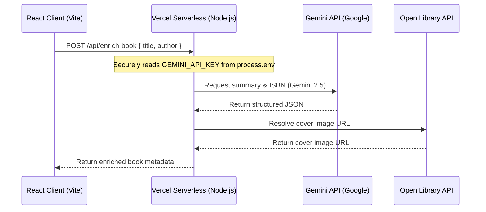

Here is a comprehensive, highly polished breakdown for your new GitHub `README.md`. It highlights your modern tech stack (Vite 6, React 19, Tailwind v4), showcases the **local-first architecture**, explains the **Gemini AI integration**, and documents your engineering decisions.

---

# Draft: `README.md`

```markdown
# 📚 My Reading Log

A high-performance, local-first reading tracker built with **React 19**, **Vite 6**, and **Dexie.js (IndexedDB)**, enriched with **Google Gemini 2.5 AI** for book summaries and personalized recommendations.

---

## ⚡ Key Features

*   **Local-First Architecture:** Instant read/write speeds and full offline capability. Your library is persisted locally using IndexedDB via Dexie.js.
*   **Gemini AI Book Enrichment:** When you add a book, a background worker calls Gemini to fetch a 2-3 sentence spoiler-free summary and ISBN, then resolves a high-quality cover image via the Open Library Covers API.
*   **AI "Next Read" Recommendations:** Analyzes your finished books and uses Gemini 2.5 to recommend 3 highly personalized books, complete with page counts, descriptions, and custom reasoning.
*   **Tombstone Sync Pattern:** Implemented soft-deletion (`deleted: true`) and a session sync manager, preparing the local-first database for seamless cloud synchronization.
*   **Polished Dark UX:** A gorgeous, fully responsive dark-mode UI styled with Tailwind CSS v4, complete with smooth transitions, loading skeletons, and interactive progress tracking.

---

## 🏗️ Architecture & Data Flow

To protect your Gemini API key and bypass CORS restrictions, the application utilizes a secure serverless proxy architecture:



---

## 🛠️ Tech Stack

*   **Frontend:** React 19 (SPA), TypeScript, Vite 6
*   **Styling:** Tailwind CSS v4 (using the `@tailwindcss/vite` plugin)
*   **Database:** Dexie.js (IndexedDB wrapper) with `dexie-react-hooks` for reactive UI state
*   **AI Integration:** `@google/generative-ai` (Gemini 2.5 Flash & Flash-Lite fallback)
*   **Backend/Hosting:** Vercel Serverless Functions (`@vercel/node`)
*   **Icons & Notifications:** Lucide React, Sonner (Toasts)

---

## 🚀 Getting Started

### Prerequisites

*   Node.js (v18 or higher)
*   An API Key from [Google AI Studio](https://aistudio.google.com/)
*   Vercel CLI (for local serverless function development)
    ```bash
    npm install -g vercel
    ```

### Installation

1. Clone the repository:
    ```bash
    git clone https://github.com/your-username/my-reading-log.git
    cd my-reading-log
    ```

2. Install dependencies:
    ```bash
    npm install
    ```

3. Configure environment variables. Create a `.env` file in the root directory:
    ```env
    GEMINI_API_KEY=your_gemini_api_key_here
    ```

### Running Locally

To run both the Vite frontend and the Vercel Serverless API routes simultaneously, use the Vercel development command:

```bash
vercel dev
```

Your app will be available at **`http://localhost:3000`**.

---

## 🧠 Engineering Decisions

### 1. Local-First with Background AI Enrichment
To ensure an instant, lag-free user experience, books are added to IndexedDB immediately with a `metadataStatus: 'pending'` state. The frontend does not block on the AI request; instead, a background worker triggers the Gemini enrichment asynchronously. Once resolved, the local database is updated, and Dexie's reactive `useLiveQuery` hook automatically updates the card UI with the new cover and summary.

### 2. Serverless Proxy for API Key Security
Calling the Gemini API directly from the browser exposes your API key in the client-side bundle and triggers CORS browser blocks. We routed all Gemini calls through Vercel Serverless Functions (`/api/enrich-book` and `/api/recommend-books`), keeping the API key completely hidden on the server-side and bypassing CORS.

### 3. Resilient Model Fallback Chain
To handle temporary Google AI Studio rate limits (`429`) or server spikes (`503`), our backend implements an automatic fallback chain. If `gemini-2.5-flash` fails, the server instantly falls back to `gemini-2.5-flash-lite` to ensure high availability and prevent user-facing errors.
```